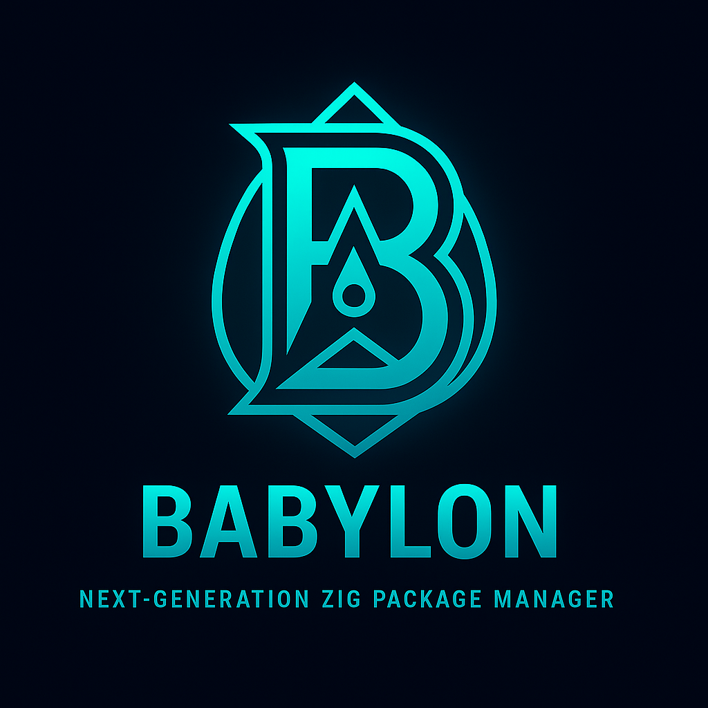

<div align="center">
  

  <br/>

  
  
  
  
</div>

# Babylon — Next-Generation Zig Package Manager

Babylon is an experimental package manager for Zig that aims to feel native to the toolchain while layering on modern conveniences: semantic versioning, deterministic lockfiles, policy enforcement, caching, and smooth collaboration flows.

## Quick Start

```sh
# initialise a new project (creates build.zig.zon + babylon.lock)
babylon init

# add a git dependency and refresh the lockfile
babylon add flash@^0.3.0 --git https://github.com/GhostKellz/flash

# add an HTTPS tarball with its expected hash
babylon add palette@1.2.0 --tarball https://example.com/palette-1.2.0.tar.gz --hash sha256:0123456789abcdef0123456789abcdef0123456789abcdef0123456789abcdef

# fetch all artifacts into the local cache
babylon fetch

# forward build invocation to zig (pass any extra flags after --)
babylon build -- -Doptimize=ReleaseSafe
```

### Command Overview

| Command | Purpose |
| --- | --- |
| `babylon init` | Scaffold manifest and lockfile |
| `babylon add <pkg>@<constraint>` | Add/update dependency entry |
| `babylon fetch [--cache-dir DIR] [--vendor]` | Resolve and cache tarball artifacts |
| `babylon cache ls [--cache-dir DIR]` | List cached objects and their sizes |
| `babylon cache prune [--cache-dir DIR] [--dry-run]` | Remove cached blobs not referenced by the lockfile |
| `babylon policy audit` | Check the lockfile against local trust policy |
| `babylon graph` | Print resolved dependency DAG |
| `babylon verify` | Basic lockfile integrity checks |
| `babylon build [-- ...zig args]` | Forward arguments to `zig build` |

## Content-Addressed Cache

Babylon stores artifacts in a SHA-256 content-addressed store under the user cache directory (e.g. `$XDG_CACHE_HOME/babylon/objects`). You can override the location per command with `--cache-dir`:

```sh
babylon fetch --cache-dir /var/cache/babylon
babylon cache prune --cache-dir /var/cache/babylon
babylon cache ls --cache-dir /var/cache/babylon
```

Use `babylon cache ls` to inspect what hashes are currently stored, and run `babylon cache prune` periodically to delete blobs that are no longer referenced by the current lockfile. Add `--dry-run` to preview what would be removed.

## Tarball Sources over HTTP(S)

Babylon supports tarballs served from `file://`, `http://`, and `https://` URLs. Tarballs are streamed into memory with a 128&nbsp;MiB safety cap before being written into the content-addressed cache.

```sh
# add a tarball dependency
babylon add palette@1.2.0 --tarball https://example.com/palette-1.2.0.tar.gz --hash sha256:0123456789abcdef0123456789abcdef0123456789abcdef0123456789abcdef

# download and cache the artifact
babylon fetch
```

Providing `--hash` is strongly recommended and may be required by your local policy. During `babylon fetch`, the tarball is fetched, hashed, and stored by digest. At present only tarball sources are fetched automatically; git and registry fetchers are under active development.

## Integrity Checks

`babylon fetch` computes a SHA-256 digest for every tarball before writing it into the cache. When the manifest or lockfile supplies an expected hash (for example via `--hash` during `babylon add`), Babylon compares the computed digest and aborts the download on mismatch. Policies with `require_hash` elevate this from a best practice to a hard gate. Because the cache is content-addressed, duplicate blobs are de-duplicated automatically and integrity re-checks remain cheap.

## Build Passthrough

`babylon build` is a thin wrapper around `zig build`. Arguments after `--` (or directly after the command) are forwarded without modification, so any standard Zig build options remain available:

```sh
# invoke zig build with a release-safe configuration
babylon build -- -Doptimize=ReleaseSafe

# keep babylon flags first; everything after -- goes to zig
babylon build --cache-dir /var/cache/babylon -- -Dtarget=aarch64-linux
```

Babylon handles dependency resolution before delegating to Zig, ensuring the cache or vendor directory is ready before the build runs.

## Policy & Trust

Optional policy enforcement is configured via `babylon.policy.json` at the project root:

```json
{
	"allow": ["ghostkellz/*"],
	"deny": ["malicious/*"],
	"require_hash": true
}
```

* `allow`: optional prefix list; if present, only matching packages are permitted. Supports `*` suffix wildcards.
* `deny`: optional prefix list; matching packages are blocked before download.
* `require_hash`: when `true`, tarball sources must provide a hash in the manifest/lockfile.

Enforcement occurs automatically during `babylon fetch`, and you can audit an existing lockfile at any time:

```sh
babylon policy audit
```

## Resolver & Diagnostics

The resolver understands caret/tilde/inequality ranges and now reports detailed conflicts, including the constraints involved and the versions offered by the registry. When conflicts arise, inspect the output, adjust `build.zig.zon`, or relax constraints as needed.

## Running the Test Suite

Development relies on Zig 0.16+. Execute all tests with:

```sh
zig build test --summary all
```

This exercises module tests, CLI integration scenarios, cache pruning, and policy enforcement.

## Roadmap

See `TODO.md` for an up-to-date, multi-phase roadmap toward “the best Zig package manager on the planet,” covering reliability, security, registry publishing, workspace support, and ecosystem polish.
